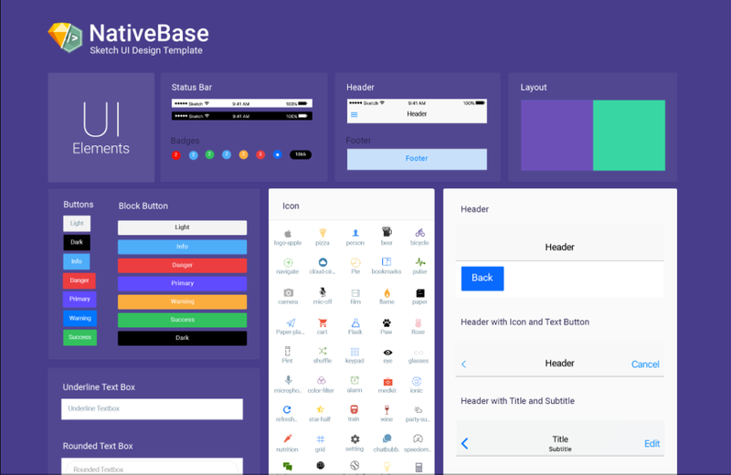
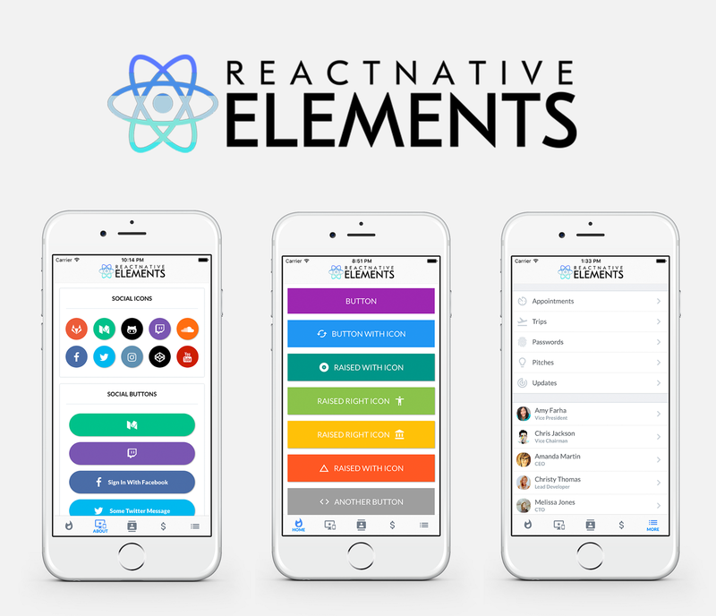
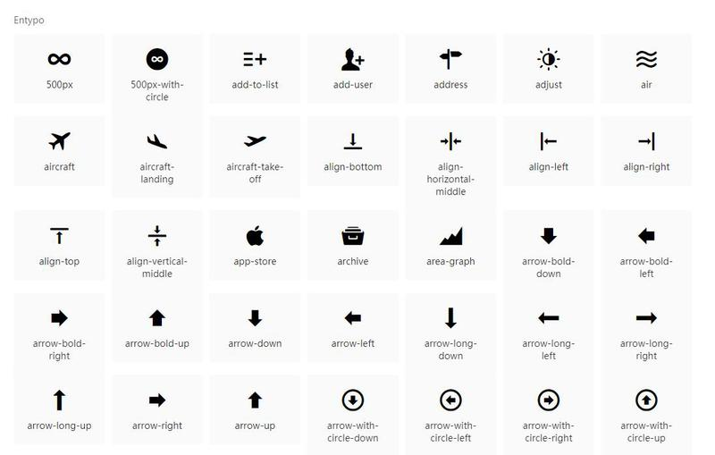
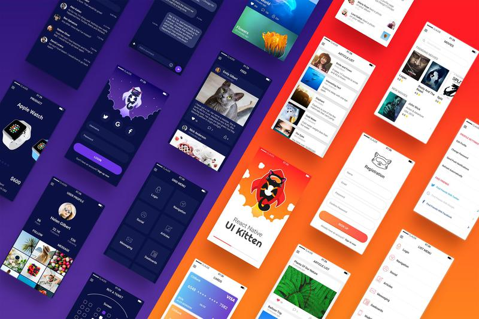
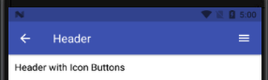
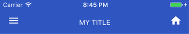

# Custom Component


## UI Component Library

React Native encourages you to build the UI of your application using isolated components. 
It is much easier to build applications using libraries and UI toolkits as 
it saves time and make development faster. 

The list does not rank any framework and is listed in a random fashion.


1. [Native Base](https://nativebase.io/)



At 12k stars and over 1k forks Native Base is a widely popular UI component library 
providing dozens of cross-platform components for React native. 
When using Native Base, you can use any native third-party libraries out of the box.

### Setup with pure React Native app

```sh
yarn add native-base

# or
# npm install native-base --save
```

### Setup with Expo

```sh
npm install native-base --save

# Native Base uses some custom fonts that can be loaded using Font.loadAsync.
expo install expo-font
```


2. [React Native Elements](https://react-native-training.github.io/react-native-elements/)



React Native Elements takes the hassle of assembling these packages together 
by giving you a ready made kit with consistent api and look and feel.

### Installation

If your project is a standard React Native project created using `react-native init` (_it should have an ios/android directory_), 
then follow these installation instructions.

- Install react-native-elements

```sh
yarn add react-native-elements

# or
# npm i react-native-elements --save
```

- Install react-native-vector-icons



```sh
yarn add react-native-vector-icons

# or
# npm i --save react-native-vector-icons
```

> *Note:*
>
> You need to follow below steps in order to work with *RN>=0.60*
>
> Now back to root folder and create a file named `react-native.config.js` in root of 
> your project and add below code in this file.

```js
// react-native.config.js
module.exports = {
    assets: ['react-native-vector-icons']
};
```

And finally run

```sh
yarn react-native link
```

View [issues react-native-vector-icons](https://github.com/oblador/react-native-vector-icons/issues/1041#issuecomment-515673115)


3. [React Native UI Kitten](https://akveo.github.io/react-native-ui-kitten/)



- Install UI Kitten and Eva Design System

```sh
npm i react-native-ui-kitten @eva-design/eva
```

- Configure Application Root

```js
import React from 'react';
import { mapping, light as lightTheme } from '@eva-design/eva';
import { ApplicationProvider } from 'react-native-ui-kitten';
import { RootComponent } from '../path-to/root.component'; // <-- Import your application entry point

const App = () => (
  <ApplicationProvider
    mapping={mapping}
    theme={lightTheme}>
    <RootComponent />
  </ApplicationProvider>
);

export default App;
```


## Header Use Component Library


### Header Native Base

```js
// header-native-base.js
import { Header, Left, Body, Right, Button, Icon, Title } from 'native-base';
...
<Header>
  <Left>
    <Button transparent>
      <Icon name='arrow-back' />
    </Button>
  </Left>
  <Body>
    <Title>Header</Title>
  </Body>
  <Right>
    <Button transparent>
      <Icon name='menu' />
    </Button>
  </Right>
</Header>
```

### Header React Native Elements

```js
// header-react-native-elements.js
import { Header } from 'react-native-elements';
...
<Header
  leftComponent={{ icon: 'menu', color: '#fff' }}
  centerComponent={{ text: 'MY TITLE', style: { color: '#fff' } }}
  rightComponent={{ icon: 'home', color: '#fff' }}
/>
```

*Result:*

| Native Base        | React Native Elements           |
| ------------- | ------------- |
|       |  |


## Button

React Native may supply you with an abundance of functionality and components that work right off the bat, 
however nothing compares to creating your own hand-crafted piece of the puzzle.

Let’s split this guide, if you want to call it that; 
into edible chunks and make you a black voodoo magic, hand-crafting component wizard.

- [Button.js](https://github.com/tuantvk/react-native-flawless-ui/blob/master/src/core/Button.js)

```js
import React from 'react';
import {
  Text,
  View,
  StyleSheet,
  TouchableOpacity,
} from 'react-native';
import PropTypes from 'prop-types';

// get name from props
// take all remaining properties defined on the props object and collect them inside an argument called rest
const Button = ({ name, ...rest }) => (
  <TouchableOpacity activeOpacity={.8} {...rest}>
    <View style={styles.btn}>
      <Text style={styles.name}>{name}</Text>
    </View>
  </TouchableOpacity>
);

// Define the props that we want to be passed to our custom component
Button.propTypes = {
  name: PropTypes.string.isRequired,
}

export default Button;
```

## Screen Sizes and Resolutions

That’s probably because the design was created using pixels whereas all dimensions in React Native are unitless, 
represented by “dp” (density-independent pixels). 
Simply put – the bigger your device is, the more dp it’ll have.

```js
import { Dimensions } from 'react-native';

const { height, width } = Dimensions.get('window');

const guidelineBaseWidth = 360;
const guidelineBaseHeight = 592;

// padding, margin, fontSize, ....
export const scale = size => width / guidelineBaseWidth * size;

// width
export const wScale = size => height / guidelineBaseHeight * size;

// height
export const hScale = (size, factor = 0.5) => size + (scale(size) - size) * factor;
```

The purpose of these functions is to be able to take one design (from a standard mobile phone) and apply it to other display sizes.

`scale` function is pretty straight forward and will return the same linear result as using viewport.

`wScale` is like scale, but based on height instead of width, which can be useful.

The real magic happens at `hScale`. The cool thing about it is that you can control the resize factor `(default is 0.5)`.

### Example:

```js
...
button: {
  padding: scale(10),
  margin: scale(25),
  width: wScale(150),
  height: hScale(30),
}
```

View on [Github](https://github.com/tuantvk/react-native-flawless-ui/blob/master/src/supports/vu.js)